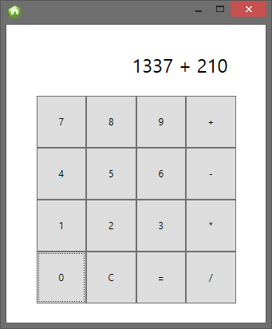

# Node-WPF Calculator

A demonstration of Node.js - WPF interop using edge.js.



## Description

This node application uses [edge.js](https://github.com/tjanczuk/edge) to host a WPF form loaded from a XAML file (thanks [Glenn](https://twitter.com/gblock)). 

You can pass in a JavaScript object with properties and methods. The C# code converts the methods to RelayCommands, and the object is then data bound to the window.

Commands fired in WPF result in the functions being called in JavaScript. So all the calulator logic is written in JavaScript.

JavaScript can then send updates through to the data context to update the display on the calculator.

## Installation

```
$ npm install
```

## Run

```
$ node app
```

## License 

MIT